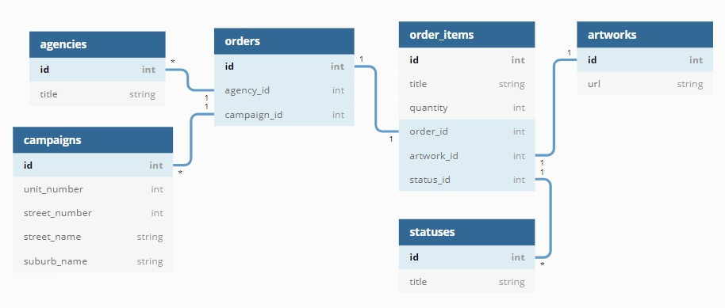

# Realhub Rails Test

- the app has a rails backend which populates a Postgres database via the realhub API
- the front end is built with React, which sends requests to the rails app (not the realhub API directly)

## Entity Relationships

- an order has 1 agency
- an agency can have many orders
- an order has 1 campaign
- a campaign can have many orders
- an order has 1 status
- a status can have many orders
- an order can have many attached images